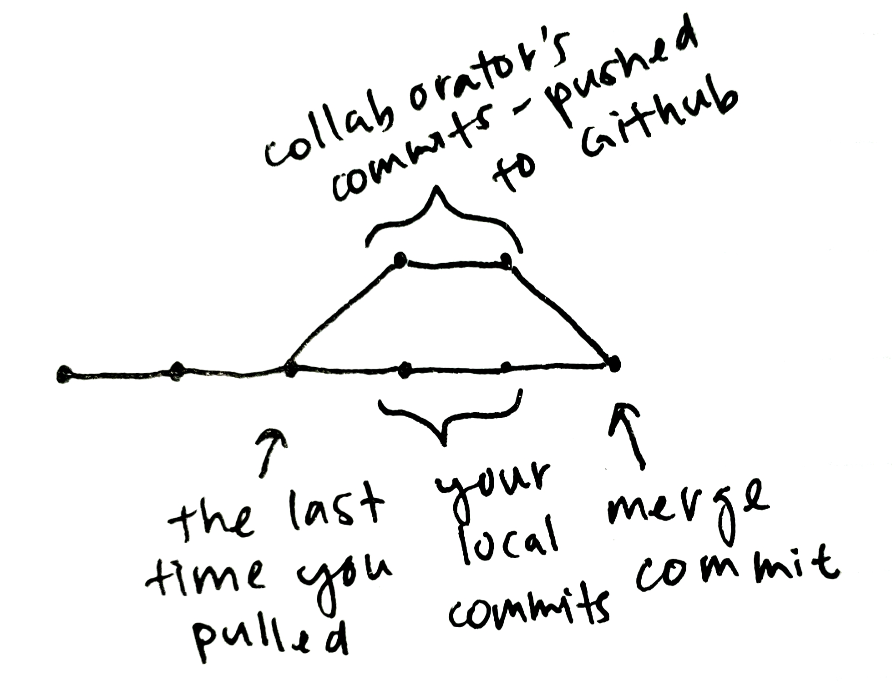
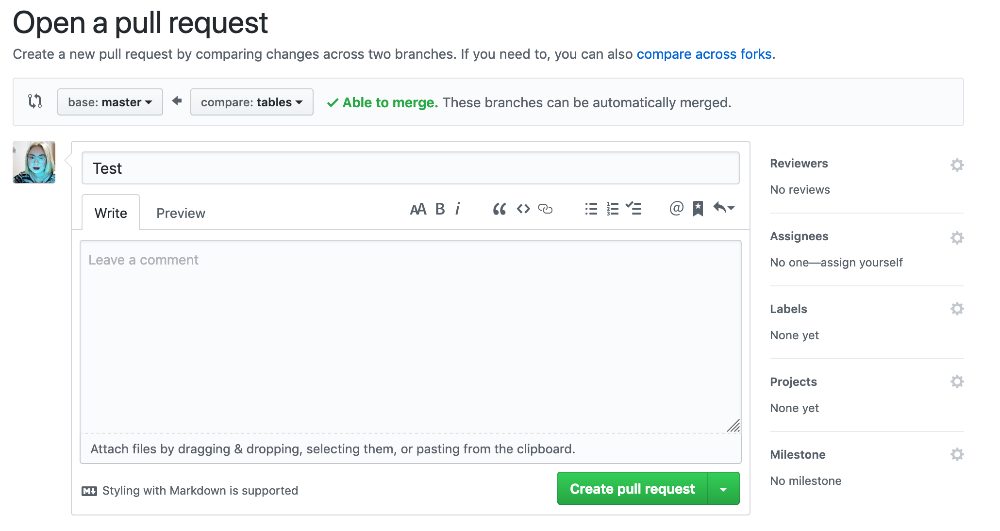
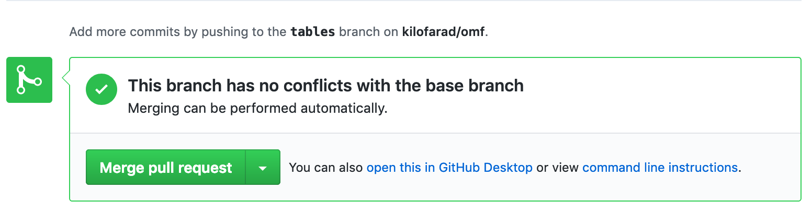

# A Beginner’s Guide to Git for Collaboration

For a decent chunk of Columbia's CS students, their primary exposure to Git is from CS 3157 – Advanced Programming. While AP is great at teaching students how to `git add` and `git commit`, it doesn't go much further than that.

When using a Git repository for version control on a collaborative project, you'll realize pretty quickly how much more there is to a fairly standard Git workflow to learn. This guide exists to help bridge that gap, to understand **how** using Git collaboratively differs from the simpler use-case of a single-branch local repo, and **why** a more complex use of Git can save you a lot of pain.

This guide presumes comfort using Git to manage a simple local repository. If you're looking for a refresher on that, check out [the Basics chapter of the free *Pro Git* book on the Git website](https://git-scm.com/book/en/v1/Git-Basics).

### Collaborating on a single branch

To be clear, I'm not recommending that anyone take this approach, but understanding what the workflow looks like when collaborating on a single branch can help get a better appreciation of how Git works and why branches are useful–or even necessary–for collaboration.

#### Pushing and pulling

When collaborating on a single branch, you'll need to have a remote set up. All this means is you have some remote server hosting your Git repository, most likely GitHub. When you `git clone` a GitHub link, you're cloning the repository and setting up the GitHub repository as a remote.

You'll need a clean working tree in order to `git pull`. If you have untracked files, you *should* be fine (as long as none of the changes you're pulling would overwrite them).  If you have any uncommited changes to tracked files, you'll need to handle those. You have three main options:
- commit them,
- `git stash` to temporarily store them away and `git stash pop` to restore them after your pull (more on this later),
- `git reset --hard` to reset all of your files to their status as of your last commit.

To `git push`, you just need to be up-to-date with the remote repository. So pull before you push!

#### Merging

Merge commits are a part of working with remotes that might be confusing at first. If both the remote repository and your local repository have commits since your last `git pull`, Git will automatically merge the divergent changes from the branching point of your last pull and prompt you to make a merge commit.



If you look at the commit log after a merge commit, you'll see that in addition to the commit's own hash, it lists the hashes of its two immediate parents.
```
commit 6fbc8e17858eba860e9a90d4485d10677437fce5 (HEAD -> master, origin/master, origin/HEAD)
Merge: 6442f738 8cb0dd04
````


#### Merge conflicts

Git can't always automatically merge the two commit histories. If you and a collaborator have both committed changes to the same file, especially within the same few lines, Git will ask you to step in and manually merge the two versions.

Git will tell you a list of files that contain merge conflicts and will edit the details of the merge conflict into the files themselves. You just need to go in, read the merge conflict, and edit it appropriately (making sure to delete the lines of text added by Git).

Reading a merge conflict is pretty straightforward. Text between `<<<<<<<` and `=======` are the local changes, and text between `=======` and `>>>>>>>` are the remote changes.

```
def sum(a, b):
<<<<<<< HEAD
  '''Returns the sum of a and b'''
=======
>>>>>>> master
  return a+b
```
In the above merge conflict, the docstring of the `sum()` function was edited/added locally since your last pull and has not been changed by a collaborator (on the remote).

```
def sum(a, b):
<<<<<<< HEAD
  '''Returns the sum of a and b'''
=======
  '''Adds a and b'''
>>>>>>> master
  return a+b
```
In this merge conflict, the docstring of the `sum()` function has been was edited/added locally since your last pull and has also been changed by a collaborator (on the remote).

Note that the default style of merge conflict won't tell you what was present the last time you pulled (this is called the common ancestor). That is, you can't distinguish whether the changes in the merge conflict were edits to existing code or new additions.

If you run this in the command line, you can enable a three-way diff:
```
$ git config merge.conflictStyle diff3
```
With this change, you can distinguish between lines that have been edits and lines that are additions.

This is an addition as a three-way merge:
```
<<<<<<< HEAD
  '''Returns the sum of a and b'''
|||||||
=======
  '''Adds a and b'''
>>>>>>> master
```

And this is an edit as a three-way merge:
```
<<<<<<< HEAD
  '''Returns the sum of a and b'''
|||||||
  '''Retruns the sum of a and b'''
=======
  '''Adds a and b'''
>>>>>>> master
```
#### More reasons not to collaborate on a single branch

As you can imagine, dealing with merge conflicts can be an abrupt and unwelcome disruption to your workflow. Sometimes, someone might even commit changes that breaks functionality you need or changes behavior in a way that creates an abrupt and unwelcome new task to fix.

If you don't see why the headache gets worse than just handling of merge commits and conflicts, think about it this way. Sharing a single git repository (without the use of branches) is like a Google Doc. Of course, Git is offline except for pushing and pulling (which is why merges occur), but it's a fundamentally similar concept.

If you're using Google Docs to write a paper with a partner, if your partner makes a change to your introduction, that change will be immediately appear on your screen.

With a non-branched Git repository, if someone makes a commit modifying `module.py`, you'll also get those changes immediately (upon pulling) whether you like it or not. That can be a problem if, for example, they edited the inputs or outputs of a `module.py` function that you use heavily.

Now you have to go and fix each place that you use that function before you can do _any_ work (or you could just sacrifice your ability to run your code). If they're making multiple changes over the course of a couple weeks, you can imagine how it could become utterly infuriating.

One deeply inadequate solution to this issue is to only commit (or only push) once you have fully completed a task. This solution fails because it negates many of the benefits that you gain from using hosted version control in the first place.

The much better solution is to use branches. You and your collaborator all share the same repository, but you can have parallel revision histories. That is, you can both make commits without being forced to immediately apply the other's. When a task is fully completed and ready to be integrated into other branches, you can then use `git merge` to apply the changes.

### Collaborating with branches

When you create a Git repository, there's one branch by default: `master`. In a typical branched repository workflow, this branch serves as a hub for all the other branches. When you want to deliver a completed task to the rest of the team, you would merge it into the master branch, and they would all merge the updated master branch into theirs. That is, when you look at the `master` branch of a really active branched Git repository, [like the Linux kernel GitHub](https://github.com/torvalds/linux/commits), every commit that isn't a brief bug-fix is a merge commit.

#### Setting up branches

So when you begin a task, the first thing you should do is set up a new branch for it. I'll assume you're on the `master` branch for now, because that's generally the point you'll want to be branching from. Pick a brief, descriptive name for your branch.

```
$ git branch tables
```
This command won't return anything, but you've just created a new branch called `tables`. To confirm that you've done so, you can run:
```
$ git branch
* master
  tables
```
This shows that you have two branches: `master`, which you're currently on, and `tables`, which you've just created.
```
$ git checkout tables
Switched to branch 'tables'
```

Now you're on the branch `tables`. You can work as usual on this branch, and none of the commits you make on the `tables` branch will affect the `master` branch. You've isolated your changes (while still making them available to your collaborators) and you are free to commit as frequently as your heart desires without needing to worry about messing with others.

#### Pushing a new branch

One additional note is that when you want to push your changes to GitHub, you'll likely encounter an error like this:
```
$ git push
fatal: The current branch tables has no upstream branch.
To push the current branch and set the remote as upstream, use

    git push --set-upstream origin tables
```

Running the command they give you will work, but let's first decode this message a little bit. When you try to push, your current branch has no configured remote/upstream branch (the two terms are interchangeable in this case).

Because you don't have a configured upstream, you need to give it an additional flag telling it to push to the `tables` branch on the remote named `origin`. If it doesn't exist (which it doesn't in our case), it will create that branch on the remote.
```
$ git push --set-upstream origin tables
Username for 'https://github.com': kilofarad
Password for 'https://kilofarad@github.com':
Total 0 (delta 0), reused 0 (delta 0)
remote:
remote: Create a pull request for 'tables' on GitHub by visiting:
remote:      https://github.com/kilofarad/omf/pull/new/tables
remote:
To https://github.com/kilofarad/omf.git
 * [new branch]        tables -> tables
Branch 'tables' set up to track remote branch 'tables' from 'origin'.
```
As we can see from the output, the command has created a new (remote) branch on GitHub's server to track your local tables branch.

#### Merging between branches

There are two main cases of merging between branches that will be important for a basic branched repository workflow.
1. When we merge changes from the master into our working branch
2. When we merge our finalized changes from a working branch into master

##### Merging through command line
Merging from master into our working branch is super straightforward. First, you'll may want to switch to the master branch and pull to make sure you have the latest changes.
```
$ git checkout master
Switched to branch 'master'
Your branch is up to date with 'origin/master'.
$ git pull
Already up to date.
```
Then, switch back to your working branch (`tables` in my case), and `git merge master`. Super simple.
```
$ git checkout tables
Switched to branch 'tables'
Your branch is up to date with 'origin/tables'.
$ git merge master
Updating 6e2ccddc..57af6cfb
```
After you run the command, you'll be prompted to make a merge commit or you'll be warned about some merge conflicts. The process is just the second half of a `git pull`, which first fetches the desired remote branch from GitHub before performing `git merge`. Because you'll already have the

##### Merging through GitHub
When you want to merge a finalized task from a working branch into the master branch, there's no reason (from a technical standpoint) why you couldn't merge through the command line and push it onto the server.

However, when merging into the master branch, it's a good idea to allow other people to review and approve your changes – just to make sure there's nothing in those changes that could be disruptive to their work. That's where GitHub's pull request comes in.

You can initiate a pull request from a branch by going to: `https://github.com/repoOwner/repoName/pull/new/branchName`.

From there, make sure your base is `master` and your compare is `tables` (or your working branch of choice). Github will tell you whether or not the changes will create any merge conflicts, allow you to title and add a short description of the changes introduced in your pull request, and allow you to request reviews from collaborators or assign them to the pull request.



Once you create the pull request, others can comment on it or even directly add commits (by adding commits to the tables branch) until it has been approved and is ready to be merged into the master branch. Once it's ready to be merged, it's as simple as pressing the **Merge pull request** button.



#### Wrapping up

Obviously, there's a lot more to Git 
